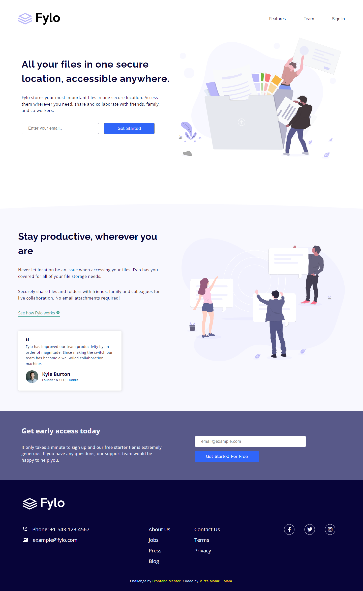

# Fylo landing page with two column layout solution

This is a solution to the [Fylo landing page with two column layout challenge on Frontend Mentor](https://www.frontendmentor.io/challenges/fylo-landing-page-with-two-column-layout-5ca5ef041e82137ec91a50f5).

- Date: 22 April 2022.

## Table of contents

- [Screenshot - Desktop ](#screenshot-desktop)
- [Screenshot - Mobile](#screenshot-mobile)
- [Links](#links)
- [Built with](#built-with)
- [Author](#author)
- [Date](#date)

## Screenshot (Desktop)

## Screenshot (Mobile)

### Links

- Solution URL: [Solution](https://your-solution-url.com)
- Live Site URL: [Live](https://ethenpage.github.io/fylo-landing-page/)

## Built with

- SCSS
- [React](https://reactjs.org/) - JS library

## Author

- Website - [Add your name here](https://www.your-site.com)
- Frontend Mentor - [@yourusername](https://www.frontendmentor.io/profile/yourusername)
- Twitter - [@yourusername](https://www.twitter.com/yourusername)

## Date

- 22 April 2022.
